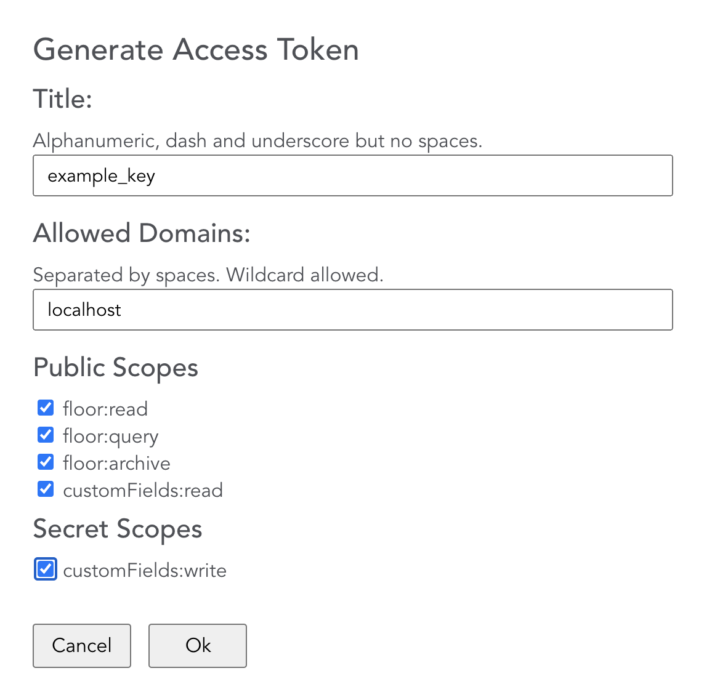

# Archilogic Support Ticket Management App Example

You can see this demo running [here](https://archilogic-ticket-management.herokuapp.com/)

This project was bootstrapped with [Create React App](https://github.com/facebook/create-react-app).  
You can learn more in the [Create React App documentation](https://facebook.github.io/create-react-app/docs/getting-started).  
To learn React, check out the [React documentation](https://reactjs.org/).

## Other Libraries Used In This Project

[Axios](https://github.com/axios/axios) - Promise based HTTP client for the browser and node.js.  
[Ant Design](https://ant.design/) - A UI Design language and React UI library.  
[Typescript](https://www.typescriptlang.org/) - Optional static type-checking along with the latest ECMAScript features.
[Redux](https://redux.js.org/) - A Predictable State Container for JS Apps.
[Moment.js](https://momentjs.com/) - Parse, validate, manipulate, and display dates and times in JavaScript.

## Install and Run

In the project directory, you can run:

	npm install

Installs all the dependencies needed for the project to run locally.

To run the app we'll need to set some environment variables first.  
We'll need an API key for the [https://developers.archilogic.com/api-keys.html](https://developers.archilogic.com/api-keys.html).


  
Once you have these keys, please create a .env file  (you can copy it from .env.example) and fill in the values for 

	cp .env.example .env
	 	
Update .env variables:

	# REACT_APP_ARCHILOGIC_PUBLISHABLE_API_KEY=YOUR_TOKEN
	# REACT_APP_ARCHILOGIC_API_URL=https://api.archilogic.com

Start Backend and Frontend with:

	npm start

The project loads a default scene. You can set a different scene by adding `?sceneId=THIS_IS_ANOTHER_SCENE_ID`.  

```html
http://localhost:3000/?sceneId=0246512e-973c-4e52-a1f2-5f0008e9ee9c
```

### The App
Simple prototype of a support ticket management app implementing the [Floor Plan Engine SDK](https://developers.archilogic.com/floor-plan-engine/guide.html) and the [Space API](https://developers.archilogic.com/space-api/v1/introduction.html).


### Archilogic library setup

check file `public\index.html`:

```html
<!DOCTYPE html>
<html lang="en">

<head>
    <meta charset="utf-8" />
    <link rel="icon" href="%PUBLIC_URL%/favicon.ico" />
    <meta name="viewport" content="width=device-width, initial-scale=1" />
    <meta name="theme-color" content="#000000" />
    <meta name="description" content="Book rooms using Archilogic Floor Plan Engine" />
    <link rel="apple-touch-icon" href="%PUBLIC_URL%/logo192.png" />

    <script src="https://code.archilogic.com/fpe-sdk/v2.2.x/fpe.js?key=%REACT_APP_ARCHILOGIC_PUBLISHABLE_API_KEY%"></script>


```


### Floorplan Initialization

In file `src\components\Floorplan\FloorPlan.tsx` when the sceneId value is available trough props, we initialize the floor-plan and attach it to the DOM element `#floorplan`

```javascript
useEffect(() => {
    const container = document.getElementById('floorplan')
    const fp = new FloorPlanEngine(container, floorPlanStartupSettings)
    fp.loadScene(props.sceneId).then(() => {
        props.setSpaces(fp.state.computed.spaces)
        onSpacesLoaded(fp.state.computed.spaces)
    })
}, [props.sceneId]);
```

### API storage

Tickets are stored in a collection on the client side, and when there is any change to that collection, we push the new updated data to the corresponding space.

In order to keep business logic clean we decoupled it into a reducer: `src\reducers\tickets.ts`

```javascript
export const resolveTicket = (ticket: Ticket, tickets: Ticket[]) => (dispatch: any) => {
    let spaceTickets = tickets.filter((t) => t.spaceId === ticket.spaceId)
    spaceTickets = updateTicketStatus(spaceTickets, ticket.key, 'Resolved')
    axios.put(`/v1/space/${ticket.spaceId}/custom-field/properties.customFields.tickets`, {
        tickets: spaceTickets
    }).then((response: any) => {
        dispatch(flagTicketAsResolved(ticket))
    })
}
```
